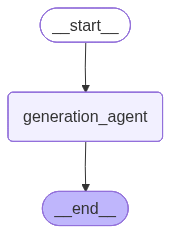

# **✉️ Email Generation Assistant & Evaluation Harness**

An enterprise-grade, multi-agent email generation and evaluation pipeline built utilizing **LangGraph**, **LangChain**, and **OpenAI**.  
This project implements an advanced LLM Assistant capable of generating highly professional emails based on Intent, Key Facts, and Tone. It also features an automated "LLM-as-a-Judge" evaluation harness to programmatically score the assistant's performance across custom metrics (Fact Recall, Tone Alignment, and Structural Conciseness).



## **📁 Project Structure & File Glossary**

```bash
email_assistant_assessment/
│
├── Result/                        # 📊 Auto-generated evaluation reports (CSV/JSON)
├── assistant.py                   # 🧠 LangGraph StateGraph connecting the agent logic
├── config.py                      # ⚙️ Environment, API key, and LangSmith configuration
├── dataset.py                     # 📝 10 Golden test scenarios & human reference emails
├── evaluate_prompt.py             # 🔬 Script to evaluate the prompt template's robustness
├── evaluator.py                   # ⚖️ Custom evaluation metrics & LLM-as-a-Judge engine
├── main.py                        # 🚀 Primary comparative evaluation pipeline script
├── prompts.py                     # 🗣️ Advanced CoT/Few-Shot prompts & Judge rubrics
├── requirements.txt               # 📦 Project dependencies
└── README.md                      # 📖 Project documentation
```

### **What Each File Does**

* **config.py**: Validates that all required environment variables (like your OpenAI key and LangSmith tokens) are loaded securely before the system runs.  
* **prompts.py**: The central hub for prompt engineering. Contains the main system prompt (utilizing Chain-of-Thought \<thinking\> tags and Few-Shot examples) as well as the grading rubrics used by the evaluator.  
* **dataset.py**: A hardcoded list of dictionaries containing 10 diverse test cases (Intent, Facts, Tone) and their ideal "Human Reference" emails for baseline comparison.  
* **assistant.py**: Defines the StateGraph using LangGraph. This is the core LLM execution engine that takes inputs, runs the model, strips out the reasoning tags, and returns the final email.  
* **evaluator.py**: The logic for our 3 custom metrics. It spins up a strict, zero-temperature "Judge" LLM to grade fact hallucination and tone, and uses Python logic to calculate text conciseness.  
* **main.py**: The primary runner. It loops through the dataset.py, generates emails using two different models/strategies, evaluates them, and exports the data directly to the Result/ folder.  
* **evaluate\_prompt.py**: A specialized script that tests the prompt itself for instruction adherence, context leakage, and token efficiency.

## **🛠️ Setup & Installation**

### **1\. Prerequisites**

Ensure you have **Python 3.9+** installed on your machine.

### **2\. Clone and Initialize**
```bash
#Clone the repository and set up an isolated Python virtual environment:  
git clone https://github.com/Saibhossain/email_gen_assist.git
cd email_gen_assist
```

```bash
# Create virtual environment  
python3 -m venv .venv
```

**Activate virtual environment**

```bash
# On Mac/Linux:  
source venv/bin/activate  
```

```bash
# On Windows:  
venv\Scripts\activate
```

### **3\. Install Dependencies**

Install the required packages using the provided requirements file:  
```bash
pip install -r requirements.txt
```
### **4\. Environment Variables**

Create a file named .env in the root directory. Add your OpenAI API key and your LangSmith credentials (if you wish to use LangSmith for tracing your LangGraph steps):  

```bash
OPENAI_API_KEY=<your api key here>

# LangSmith Tracing Configuration  
LANGSMITH_TRACING=true
LANGSMITH_ENDPOINT=https://api.smith.langchain.com
LANGSMITH_API_KEY=<your api key here>
LANGSMITH_PROJECT="Email_assist"

```

## **🚀 Execution Guide**

### **1\. Run the Primary Evaluation (Model Comparison)**

To test the Assistant and evaluate two different LLM strategies against the 10 test scenarios, execute:  

```bash
python main.py
```
**Execution Flow:**

* The system invokes the LangGraph assistant for all 10 scenarios across the configured models.  
* The Evaluator scores every output based on the custom metrics.  
* Structured data is exported automatically to the Result/ directory.

### **2\. Run the Prompt Performance Evaluation**

To strictly test the architectural robustness of the prompt template (Instruction adherence, Few-Shot isolation, Efficiency), execute:  
```bash
python evaluate_prompt.py
```
**Execution Flow:**

* The system evaluates the EMAIL\_GENERATION\_SYSTEM\_PROMPT directly.  
* Tests for \<thinking\> tag usage, leakage of few-shot entities (e.g., "Alex", "Lisbon"), and token efficiency.  
* Results are exported to the Result/ directory.

## **📊 Outputs & Results**

All execution outputs are safely stored in the dynamically generated Result/ directory. After running the execution scripts, you will find:

1. **Result/evaluation\_raw\_data\_output.csv**: A comprehensive row-by-row breakdown of every generated email, the model utilized, and the specific scores and reasoning for all 3 Custom Metrics.  
2. **Result/evaluation\_summary\_report.json**: High-level aggregated averages comparing the overall performance of the tested models across the scenarios.  
3. **Result/prompt\_performance\_report.json**: The architectural assessment of the prompt template itself, detailing instruction adherence rates and context leakage test results.


# 👨‍💻 Author
# **Md Saib Hossain**
**AI Engineer • AI / ML / LLM & AI Safety Researcher**  
**Agentic AI Developer • Researcher in Autonomous & Multi-Agent Systems • Advanced Agentic AI Architect**

Designing safe, scalable, and human-centered intelligent systems for real-world healthcare and autonomous AI applications.

<p align="left">
  <a href="mailto:saibhossain5@gmail.com">
    
  </a>
  <a href="https://saibhossain.github.io/">
    
  </a>
  <a href="https://github.com/Saibhossain">
    
  </a>
  <a href="https://linkedin.com/in/saib-hossain-182834229">
    
  </a>
</p>